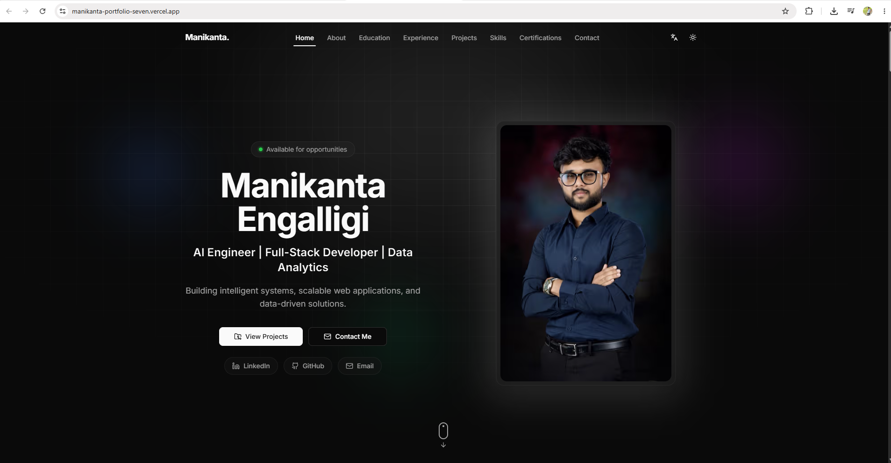

<div align="center">

# Manikanta Engalligi Portfolio

### AI Engineer • Full-Stack Developer • Data Analytics

A modern, responsive, multilingual personal portfolio built with **Next.js 15**, **TypeScript**, and **Tailwind CSS** showcasing my projects, technical skills, certifications, professional experience, and resume.


[](https://manikanta-portfolio-seven.vercel.app)

</div>
---

# Portfolio Preview

<p align="center">
  
</p>
---

# About the Project

This portfolio was designed and developed to serve as my professional online presence where recruiters, hiring managers, collaborators, and fellow developers can learn more about me, explore my projects, review my technical skills, download my resume, and contact me directly.

The application follows modern software engineering practices with a strong emphasis on performance, accessibility, responsive design, clean UI/UX, SEO optimization, scalability, and maintainable code.

Visitors can also send messages directly through an integrated EmailJS contact form without requiring a custom backend server.

---

# Features

- Responsive design across desktop, tablet, and mobile devices
- Built with Next.js 15 App Router
- TypeScript with Strict Mode
- Tailwind CSS v4
- Modern UI using shadcn/ui
- Interactive animations with Framer Motion
- English & German language support
- Dark / Light theme
- Professional Hero section
- About section
- Education timeline
- Experience timeline
- Project showcase
- Technical Skills section
- Certifications section
- Resume download
- EmailJS Contact Form
- Cloudinary image optimization
- SEO optimized metadata
- Dynamic Sitemap
- Robots.txt generation
- Progressive Web App (PWA)
- Production deployment using Vercel

---

# Tech Stack

| Category | Technology |
|-----------|------------|
| Framework | Next.js 15 (App Router) |
| Language | TypeScript |
| Styling | Tailwind CSS v4 |
| UI Components | shadcn/ui + Radix UI |
| Animation | Framer Motion |
| Internationalization | next-intl |
| Backend Services | Supabase |
| Image Optimization | Cloudinary |
| Contact Form | EmailJS |
| Theme | next-themes |
| Deployment | Vercel |

---

# Project Structure

```text
Manikanta-Portfolio
│
├── app/                     # Next.js App Router
├── components/              # Reusable UI Components
├── sections/                # Portfolio Sections
├── data/                    # Portfolio Data
├── hooks/                   # Custom React Hooks
├── i18n/                    # Internationalization
├── lib/
│   ├── supabase/            # Database Clients
│   ├── emailjs.ts           # Contact Form Integration
│   ├── cloudinary.ts        # Image Management
│   └── utils.ts             # Utility Functions
├── messages/                # Translation Files
├── providers/               # Theme Providers
├── public/
│   ├── images/
│   ├── certificates/
│   └── resume/
├── types/
├── .env.example
└── README.md
```

---

# Getting Started

### 1. Clone the Repository

```bash
git clone https://github.com/Manikanta679/Manikanta-portfolio.git
cd Manikanta-portfolio
```

---

### 2. Install Dependencies

```bash
npm install
```

---

### 3. Configure Environment Variables

Create a `.env.local` file in the project root.

Copy the values from:

```text
.env.example
```

Then add your EmailJS credentials.

Example:

```env
NEXT_PUBLIC_EMAILJS_PUBLIC_KEY=YOUR_PUBLIC_KEY

NEXT_PUBLIC_EMAILJS_SERVICE_ID=YOUR_SERVICE_ID

NEXT_PUBLIC_EMAILJS_TEMPLATE_ID=YOUR_TEMPLATE_ID
```

---

### 4. Start the Development Server

```bash
npm run dev
```

Visit:

```
http://localhost:3000
```

---

# Available Scripts

| Command | Description |
|----------|-------------|
| npm run dev | Starts the development server |
| npm run build | Creates the production build |
| npm run start | Starts the production server |
| npm run lint | Runs ESLint |
| npm run typecheck | Performs TypeScript type checking |
| npm run format | Formats the project using Prettier |

---

# Internationalization

The portfolio supports multiple languages using **next-intl**.

Current supported languages:

- 🇺🇸 English
- 🇩🇪 German

Translation files are located inside:

```
messages/
```

---

# Contact Form

The contact form is powered by **EmailJS**, allowing visitors to contact me directly without requiring a backend server.

Required Environment Variables:

```env
NEXT_PUBLIC_EMAILJS_PUBLIC_KEY

NEXT_PUBLIC_EMAILJS_SERVICE_ID

NEXT_PUBLIC_EMAILJS_TEMPLATE_ID
```

---

# Deployment

The application is optimized for deployment on **Vercel**.

Deployment Steps:

1. Push the repository to GitHub.
2. Import the repository into Vercel.
3. Configure the required Environment Variables.
4. Deploy.

Live Website:

### https://manikanta-portfolio-seven.vercel.app

---

# License

This project was created as a personal portfolio to showcase my work, technical skills, and professional experience.

Feel free to explore the source code for learning and inspiration.

---

<div align="center">

### If you found this project useful, consider giving it a Star.

Made with ❤️ by **Manikanta Engalligi**

</div>